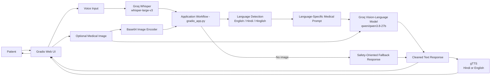

# VaidyaAI

VaidyaAI is an AI-powered medical assistant that lets patients ask questions using their voice and optionally provide a medical image. It transcribes the patient's speech, detects the response language, analyzes the image when available, and returns a concise text and voice response.

> VaidyaAI is an informational assistant, not a replacement for a qualified medical professional. It does not provide definitive diagnoses or prescribe medication dosages.

## Why this project?

Many patients find it easier to describe symptoms by speaking than by typing. VaidyaAI combines voice interaction with optional visual context so users can explain a concern naturally and receive an accessible response in English, Hindi, or Hinglish.

The project also demonstrates how speech recognition, multimodal AI, language detection, text-to-speech, and a lightweight web interface can work together in one practical healthcare workflow.

## Features

- Voice-based patient input through a microphone.
- Speech transcription using Groq Whisper (`whisper-large-v3`).
- Optional medical image upload for visual analysis.
- Vision-language analysis using Groq's `qwen/qwen3.8-27b` model.
- Automatic detection of English, Hindi, and Hinglish input.
- Language-specific, patient-friendly response prompts.
- Text response organized as assessment, possible cause, next steps, precautions, and when to seek care.
- Hindi or English voice output using Google Text-to-Speech.
- Gradio interface with separate patient input and doctor response areas.
- Safe response guidance: no definitive diagnosis, invented findings, or medication dosage recommendations.

## Tech Stack

- **Python**: Application and workflow logic.
- **Gradio**: Browser-based user interface.
- **Groq API**: Speech transcription and multimodal model inference.
- **Whisper Large V3**: Patient voice transcription.
- **Qwen 3.8 27B**: Medical image and question analysis through Groq.
- **gTTS**: Text-to-speech conversion.
- **python-dotenv**: Loading environment variables from a `.env` file.


## Project Structure

```text
VaidyaAI/
├── brain_of_the_doctor.py   # Image encoding and Groq vision analysis
├── gradio_app.py             # Main workflow, language detection, and UI
├── voice_of_the_doctor.py   # Converts responses to Hindi or English speech
├── voice_of_the_patient.py  # Transcribes patient audio with Groq Whisper
├── requirements.txt          # Python dependencies
├── LICENSE                   # MIT license
└── README.md                 # Project documentation
```

## How the Workflow Works

1. The patient records a voice question in the Gradio interface and may upload a medical image.
2. If audio is provided, `voice_of_the_patient.py` sends it to Groq Whisper and returns the transcription.
3. `gradio_app.py` detects whether the text is English, Hindi, or Hinglish using Devanagari character ratios and common Hinglish words.
4. The app builds a language-specific medical assistant prompt with safety and response-format rules.
5. If an image is provided, `brain_of_the_doctor.py` Base64-encodes it and sends it with the patient query to the Groq vision-language model.
6. If no image is provided, the app returns a predefined response asking for more symptom details and highlighting urgent warning signs.
7. Markdown markers are removed from the model response.
8. `voice_of_the_doctor.py` converts the response into Hindi or English speech and saves it as `doctor_response.mp3`.
9. The UI displays the transcription, written response, and playable doctor voice response.

## System Architecture




## License

This project is licensed under the MIT License. See [LICENSE](LICENSE) for details.
